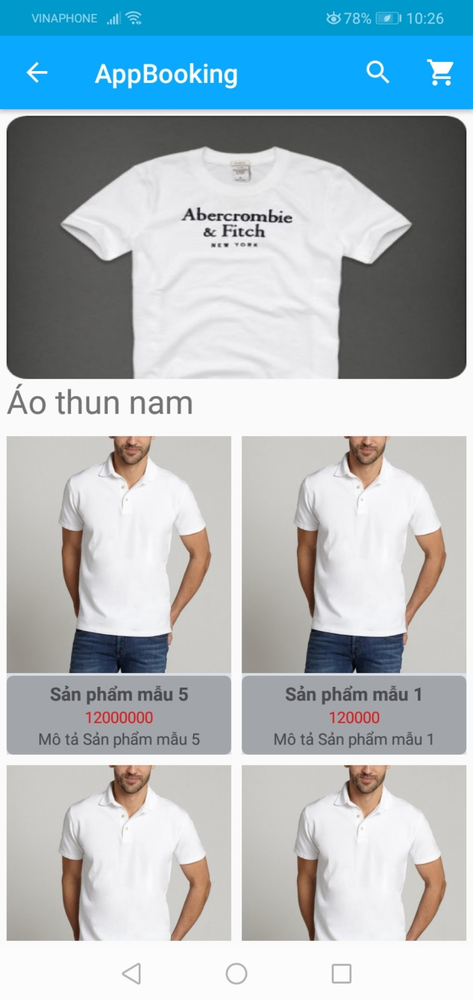
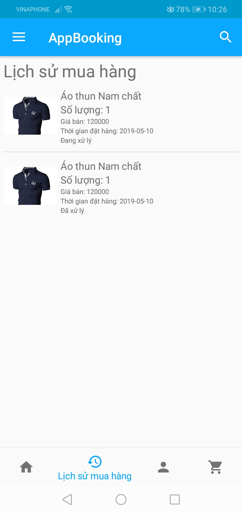
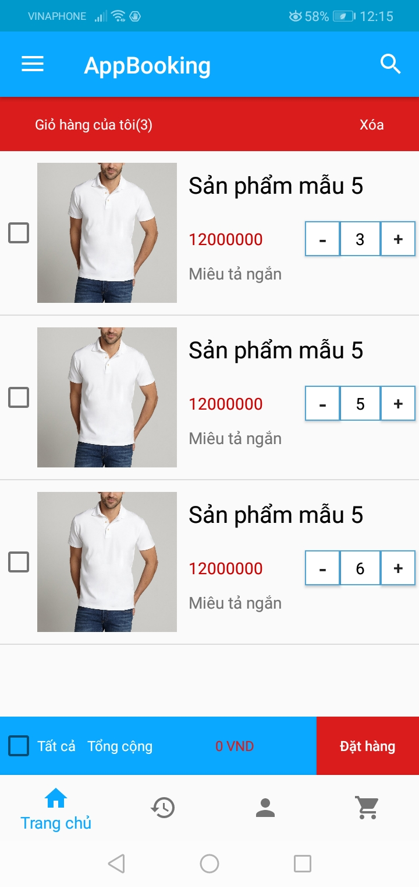
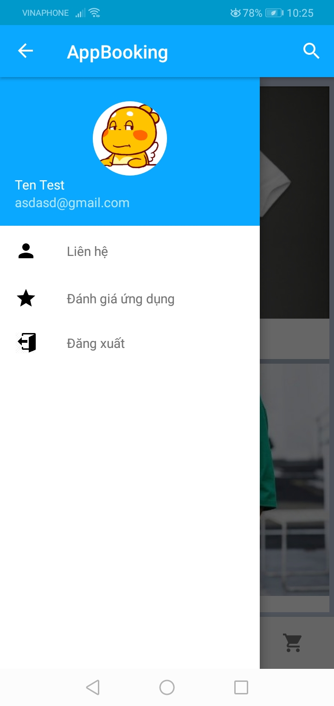

# Các tính năng hỗ trợ
Nhóm xây dựng ứng dụng đặt hàng có đầy đủ chức năng cần thiết cho nhu cầu mua bán thực tế của người dùng. Ứng dụng gồm có:
* Trang các chuyên mục sản phẩm (category): hiển thị ảnh đại diện, tiêu đề, mô tả ngắn cho từng chuyên mục, khi nhấn vào mỗi chuyên mục sẽ hiển thị các sản phẩm thuộc chuyên mục đó.
* Trang các sản phẩm của từng chuyên mục gồm: ảnh đại diện, tên sp, giá, khi nhấn vào sẽ ra trang chi tiết của sản phẩm đó.
* Trang chi tiết hiển thị thông tin chi tiết của sản phẩm.
* Tính năng tìm kiếm sản phẩm
* Cho phép khách hàng đặt hàng online
* Cho phép người dùng đăng ký, đăng nhập để lưu thông tin đặt hàng và các thông tin cá nhân khác.

# Cấu trúc mã nguồn
Mã nguồn được sắp xếp thành các gói (package) được phân ra theo các hoạt động (Activity) của ứng dụng:
* Gói category quản lý các tác vụ liên quan tới trang hoạt động hiển thị các sản phẩm cùng danh mục category.
* Gói common chứa các lớp dùng chung phổ biến trong ứng dụng, các lớp này là các đóng gói dữ liệu đơn giản thường chỉ chứa các hàm set/get.
* Gói detail hiện tại chỉ chứa một lớp DetailActivity xử lý tất cả các tác vụ liên quan đến trang hiển thị chi tiết sản phẩm.
* Gói login chỉ chứa một lớp LoginActivity xử lý tất cả các tác vụ liên quan đến trang hiển thị đăng nhập.
* Gói main chứa lớp MainActivity xử lý giao diện chung của trang hoạt động chính và một đóng gói các fragment gồm các gói nhỏ quản lý 4 fragment chia thành các gói nhỏ hơn:
	+ Gói cart chứa các lớp dùng cho fragment quản lý đặt hàng.
	+ Gói history chứa các lớp dùng cho fragment quản lý lịch sử đặt hàng.
	+ Gói home chứa các lớp dùng cho fragment quản lý trang chủ hiển thị các danh mục sản phẩm.
* Gói person chứa duy nhất một lớp chứa toàn bộ logic và các đối tượng cần cho fragment quản lý và thay đổi thông tin người dùng.
* Gói register chứa duy nhất một lớp chứa toàn bộ logic và các đối tượng cần cho trang hoạt động quản lý yêu cầu đăng ký người dùng.
* Gói search quản lý trang hoạt động tìm kiếm, có thiết kế tương tự với gói Category nhưng dùng phương thức POST khi gửi request thay vì là GET.
* Gói ultis chứa các lớp lưu dữ liệu và các xử lý tác vụ tập trung gồm.

# Cơ chế nhận gửi dữ liệu từ Server
Nhóm sử dụng một server đơn giản viết bằng PHP để xử lý các request từ phía client. Mỗi request sẽ gửi đến một địa chỉ web riêng xử lý request đó. Các địa chỉ gồm:
* http://booking.vihey.com/api/home.php
* http://booking.vihey.com/api/category.php
* http://booking.vihey.com/api/product.php
* http://booking.vihey.com/api/register.php
* http://booking.vihey.com/api/login.php
* http://booking.vihey.com/api/updateuser.php
* http://booking.vihey.com/api/booking2.php
* http://booking.vihey.com/api/history.php
* http://booking.vihey.com/api/search.php
* http://booking.vihey.com/api/changepassword.php
* http://booking.vihey.com/api/searchPost.php

# Một số hình ảnh của ứng dụng

